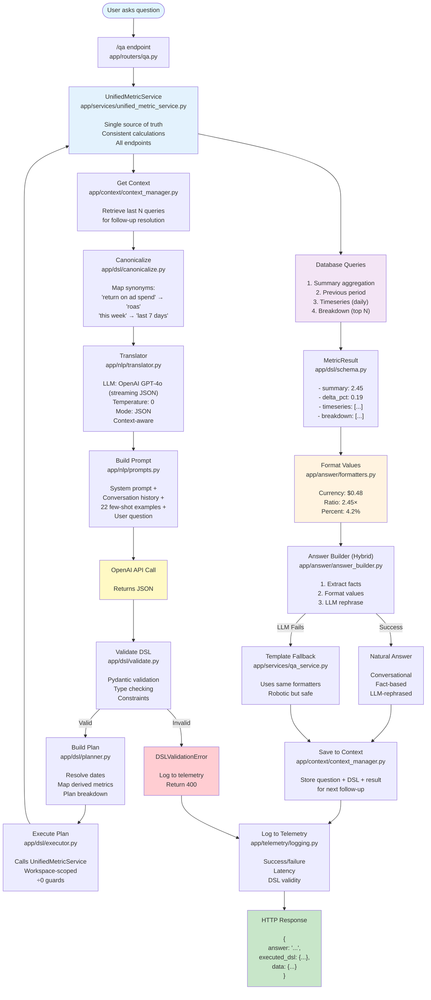

# QA System Architecture & DSL Specification

**Version**: DSL v2.5.2 (Worker Infrastructure + Debug Tooling)
**Last Updated**: 2025-11-25
**Status**: Production Ready - Real-time Streaming + Worker Documentation

---

## Table of Contents

1. [Overview](#overview)
2. [System Architecture](#system-architecture)
3. [Core Components](#core-components)
4. [Worker Infrastructure](#worker-infrastructure)
5. [Visual Builder](#visual-builder)
6. [Specifications](#specifications)
7. [Operational Guides](#operational-guides)
8. [Future Roadmap](#future-roadmap)

---

## Overview

The AdNavi QA (Question-Answering) system translates natural language questions into validated database queries using a **DSL (Domain-Specific Language)**.

### Why This Architecture?

**Safety First:**
- LLM outputs JSON DSL (never raw SQL)
- Backend validates and executes (single source of truth)
- Workspace scoping prevents data leaks
- Divide-by-zero guards for derived metrics

**Deterministic & Testable:**
- Clear pipeline: question → DSL → plan → execution → answer
- Each stage is testable independently
- Reproducible results (temperature=0 for LLM)
- Comprehensive unit tests (100+ tests)

**Observable:**
- Every query logged with DSL, latency, validity
- Success/failure metrics tracked
- Error analytics for continuous improvement
- Structured telemetry

---

## System Architecture

### System Flow Diagram



### Data Flow Architecture

The following diagram shows how data flows through the system, from raw user questions to structured answers, highlighting the key transformations and decision points:

```mermaid
flowchart TD
    %% Input Layer
    UserQ["👤 User Question<br/>'What's my ROAS this month?'"] --> Auth["🔐 Authentication<br/>JWT Token Validation<br/>Workspace Scoping"]
    
    %% Context Layer
    Auth --> Context["📚 Context Retrieval<br/>Last 5 queries<br/>Follow-up resolution<br/>User + Workspace isolation"]
    
    %% Preprocessing Layer
    Context --> Canon["🔄 Canonicalization<br/>Synonym mapping<br/>Time phrase normalization<br/>Entity name preservation"]
    
    %% LLM Translation Layer
    Canon --> LLM["🤖 LLM Translation<br/>GPT-4o streaming (temp=0)<br/>22 few-shot examples<br/>Context-aware prompts"]
    
    %% DSL Generation
    LLM --> DSL["📋 DSL Generation<br/>JSON structure<br/>Query type classification<br/>Metric/time range resolution"]
    
    %% Validation Layer
    DSL --> Valid["✅ Validation<br/>Pydantic v2<br/>Schema constraints<br/>Type checking"]
    
    %% Planning Layer
    Valid --> Plan["📅 Planning<br/>Date resolution<br/>Metric dependencies<br/>Execution strategy"]
    
    %% Execution Layer
    Plan --> Exec["⚙️ Execution<br/>Workspace-scoped queries<br/>Multi-level facts<br/>Derived metrics"]
    
    %% Data Processing
    Exec --> Data["📊 Data Processing<br/>Base measures aggregation<br/>Metric calculations<br/>Breakdown grouping"]
    
    %% Results Layer
    Data --> Results["📈 Results<br/>Summary values<br/>Previous period<br/>Timeseries data<br/>Breakdown items"]
    
    %% Formatting Layer
    Results --> Format["🎨 Formatting<br/>Currency: $0.48<br/>Ratios: 2.45×<br/>Percentages: 4.2%<br/>Counts: 1,234"]
    
    %% Answer Generation
    Format --> Answer["💬 Answer Generation<br/>Intent classification<br/>Hybrid LLM + templates<br/>Natural language"]
    
    %% Output Layer
    Answer --> Output["📤 Response<br/>Natural answer<br/>Executed DSL<br/>Raw data<br/>Context used"]
    
    %% Error Handling
    Valid -->|Invalid| Error["❌ Error Handling<br/>DSL validation errors<br/>Helpful messages<br/>Fallback responses"]
    LLM -->|Fail| Error
    Exec -->|Fail| Error
    Answer -->|Fail| Error
    
    %% Context Storage
    Output --> Store["💾 Context Storage<br/>Question + DSL + result<br/>FIFO eviction<br/>Thread-safe"]
    
    %% Telemetry
    Output --> Telemetry["📊 Telemetry<br/>Success/failure<br/>Latency tracking<br/>Error analytics"]
    Error --> Telemetry
    
    %% Styling
    classDef inputLayer fill:#e3f2fd,stroke:#1976d2,stroke-width:2px
    classDef processingLayer fill:#f3e5f5,stroke:#7b1fa2,stroke-width:2px
    classDef dataLayer fill:#e8f5e8,stroke:#388e3c,stroke-width:2px
    classDef outputLayer fill:#fff3e0,stroke:#f57c00,stroke-width:2px
    classDef errorLayer fill:#ffebee,stroke:#d32f2f,stroke-width:2px
    
    class UserQ,Auth inputLayer
    class Context,Canon,LLM,DSL,Valid,Plan processingLayer
    class Exec,Data,Results,Format dataLayer
    class Answer,Output,Store,Telemetry outputLayer
    class Error errorLayer
```



#### Key Data Transformations

1. **Question → Canonicalized**: Natural language standardized
2. **Canonicalized → DSL**: Structured JSON query generated
3. **DSL → Plan**: Execution strategy determined
4. **Plan → Data**: Database queries executed
5. **Data → Results**: Metrics calculated and aggregated
6. **Results → Formatted**: Values formatted for display
7. **Formatted → Answer**: Natural language response generated

#### Data Flow Characteristics

- **Workspace Isolation**: All data queries scoped to user's workspace
- **Multi-Level Facts**: Data available at campaign, adset, and ad levels
- **Derived Metrics**: 24 metrics supported with divide-by-zero guards
- **Context Awareness**: Follow-up questions resolved using conversation history
- **Error Resilience**: Multiple fallback layers ensure responses are always generated

---

## Core Components

### 1️⃣ **Entry Point** (`app/routers/qa.py`)
- HTTP POST endpoint `/qa`
- Accepts: `{ "question": "What's my ROAS this week?" }`
- Requires: `workspace_id` query param + auth token (JWT cookie)
- Returns: `{ answer, executed_dsl, data, context_used }`

### 2️⃣ **Orchestration** (`app/services/qa_service.py`)
- Main coordinator for the entire pipeline
- Retrieves conversation context for follow-ups
- Saves conversation history after execution
- **Translation Retry Logic**: Automatic retry up to 2 times with exponential backoff
- **Error Handling**: Returns helpful user-facing messages instead of raising exceptions
- Handles error propagation and logging
- Measures total latency
- Ensures answer generation latency is always numeric (prevents None values)

### 2️⃣.1️⃣ **Date Parsing** (`app/dsl/date_parser.py`)
- **Purpose**: Pre-parse date ranges to guide LLM
- **How**: Pattern matching for common phrases ("last week", "in September")
- **Output**: Structured date range (`{"last_n_days": 7}` or `{"start": ..., "end": ...}`)
- **Benefit**: Reduces LLM ambiguity and date-related errors

### 3️⃣ **Context Retrieval** (`app/context/context_manager.py`)
- **Purpose**: Enable multi-turn conversations and follow-up questions
- **Retrieves**: Last N queries (default 5) for this user+workspace
- **Scoping**: User + workspace isolated (no cross-tenant leaks)
- **Storage**: In-memory (fast, <1ms operations)
- **Thread-safe**: Uses locks for concurrent request safety
- **Examples**:
  - "Show me ROAS by campaign" → "Which one performed best?"
  - "What's my ROAS this week?" → "And yesterday?"

### 4️⃣ **Canonicalization** (`app/dsl/canonicalize.py`)
- **Purpose**: Reduce LLM variance by normalizing inputs
- **Synonym mapping**:
  - `"return on ad spend"` → `"roas"`
  - `"cost per acquisition"` → `"cpa"`
  - `"click-through rate"` → `"ctr"`
  - `"cost per click"` → `"cpc"`
- **Time phrase normalization**:
  - `"this week"` → `"last 7 days"`
  - `"this month"` → `"last 30 days"`
  - `"yesterday"` → `"last 1 day"`

### 5️⃣ **Translation** (`app/nlp/translator.py`)
- **LLM**: OpenAI GPT-4o (streaming JSON mode, override via `OPENAI_MODEL`)
- **Settings**: Temperature=0 (deterministic), JSON mode with streaming assembly for SSE compatibility
- **Input**: Canonicalized question + conversation context
- **Output**: Raw JSON DSL (validated in next step)
- **Context handling**: Includes last 1-2 queries for follow-up resolution
- **Few-shot learning**: 22+ examples covering all query types (including provider comparisons and sort_order patterns)
- **Retry Logic**: Automatic retry up to 2 times on translation failures with exponential backoff
- **Comprehensive Examples**: Added detailed provider comparison examples for complex queries with multiple metrics and time ranges

### 6️⃣ **Prompting** (`app/nlp/prompts.py`)
- **System Prompt**: Task explanation, constraints, schema, sort_order rules
- **Few-Shot Examples**: 22 question → DSL pairs
  - 5 original examples (ROAS, conversions, revenue, CPA)
  - 10 derived metrics examples (CPC, CPM, CPL, CPI, CPP, POAS, AOV, ARPV, CTR)
  - 2 non-metrics examples (providers, entities)
  - 5 sort_order examples (highest/lowest variations)
- **Follow-up Examples**: 5 examples for context-aware queries
- **Format**: System prompt + examples + context (if available) + user question

### 7️⃣ **Validation** (`app/dsl/validate.py`)
- **Engine**: Pydantic v2
- **Early Checks**:
  - Empty DSL detection before Pydantic validation
  - Returns helpful error message for translation failures
- **Validates**:
  - Query type (metrics, providers, entities)
  - Metric is valid (24 metrics supported)
  - Time range constraints (1-365 days or valid date range)
  - Filters match schema
  - `top_n` is 1-50
- **Errors**: Raises `DSLValidationError` with helpful messages

### 8️⃣ **Planning** (`app/dsl/planner.py`)
- **Resolves**:
  - Relative dates → Absolute dates (`last_n_days: 7` → `2025-09-24 to 2025-09-30`)
  - Derived metrics → Base measures (uses `app/metrics/registry`)
  - Comparison windows (previous period dates)
  - Breakdown requirements
- **Output**: `Plan` object with execution details
- **Optimization**: Returns None for non-metrics queries (handled directly by executor)

### 9️⃣ **Execution** (`app/dsl/executor.py`)
- **Unified Metrics Refactor**:
  - Now calls `UnifiedMetricService` for all metric calculations
  - Single source of truth for consistent results across all endpoints
  - Eliminates data mismatches between QA and UI dashboards
- **Service Integration**:
  - `_execute_metrics_plan()` → `service.get_summary()`
  - `_execute_multi_metric_plan()` → `service.get_summary()` with multiple metrics
  - Timeseries → `service.get_timeseries()`
  - Breakdowns → `service.get_breakdown()`
- **Query Types**:
  1. **Metrics queries**: Summary, previous period, timeseries, breakdown
  2. **Providers queries**: Distinct ad platforms in workspace
  3. **Entities queries**: List campaigns/adsets/ads with filters
- **Safety**:
  - All queries workspace-scoped (tenant isolation)
  - Divide-by-zero guards in `app/metrics/formulas`
  - Consistent filtering logic across all endpoints

### 🔟 **UnifiedMetricService** (`app/services/unified_metric_service.py`)

**Single source of truth for all metric calculations**.

**Key Methods**:
- `get_summary()`: Aggregate metrics with optional previous period comparison
- `get_timeseries()`: Daily breakdown of metrics
- `get_breakdown()`: Group by provider, level, or temporal dimensions
- `get_workspace_average()`: Workspace-wide averages for context

**Hierarchy Rollups**:
- When filtering by `entity_name` (e.g., "Product Launch Teaser campaign"), the service uses hierarchy CTEs to roll up metrics from **descendant entities only**
- Why: Campaign-level facts may be stale; children (adsets/ads) have real-time data
- How: Uses `campaign_ancestor_cte` or `adset_ancestor_cte` to find all descendants, then queries facts for descendants only (excludes parent entity's own fact)
- Logging: Comprehensive logging at each step to track which entities are included/excluded

**Service Architecture**:
```python
class UnifiedMetricService:
    def get_summary(self, workspace_id, metrics, time_range, filters, compare_to_previous=False):
        # Consistent aggregation logic used by all endpoints
        # Returns MetricSummaryResult with value, previous, delta_pct
        
    def get_timeseries(self, workspace_id, metrics, time_range, filters):
        # Daily breakdown with consistent date handling
        # Returns list of TimeSeriesPoint objects
        
    def get_breakdown(self, workspace_id, metric, time_range, filters, breakdown_dimension, top_n, sort_order):
        # Provider, level, or temporal breakdowns
        # Returns list of BreakdownItem objects
```

### 1️⃣1️⃣ **Result Building** (`app/dsl/schema.py`)

**MetricResult** structure:
```json
{
  "summary": 2.45,           // Main metric value
  "previous": 2.06,          // Previous period value
  "delta_pct": 0.189,        // Percentage change (18.9%)
  "timeseries": [            // Daily values (ISO YYYY-MM-DD)
    {"date": "2025-09-24", "value": 2.30},
    {"date": "2025-09-25", "value": 2.45}
  ],
  "breakdown": [             // Top entities
    {"label": "Summer Sale", "value": 3.20},
    {"label": "Winter Campaign", "value": 2.80}
  ]
}
```

### 1️⃣2️⃣ **Value Formatting** (`app/answer/formatters.py`)

**Single source of truth for display formatting** (prevents "$0" bugs):

- **Currency**: `format_metric_value("cpc", 0.4794)` → `"$0.48"`
- **Ratios**: `format_metric_value("roas", 2.456)` → `"2.46×"`
- **Percentages**: `format_metric_value("ctr", 0.042)` → `"4.2%"`
- **Counts**: `format_metric_value("clicks", 1234)` → `"1,234"`
- **Deltas**: `format_delta_pct(0.19)` → `"+19.0%"`

Used by both AnswerBuilder (GPT prompts) and QAService (fallback templates).

### 1️⃣3️⃣ **Intent Classification** (`app/answer/intent_classifier.py`)

**Purpose**: Match answer depth to user's question intent

**Classification Logic** (keyword + DSL analysis):

- **SIMPLE Intent** → 1 sentence answer
  - Keywords: "what was", "how much", "show me"
  - DSL: No comparison, no breakdown
  - Example: "what was my roas" → "Your ROAS last month was 3.88×"

- **COMPARATIVE Intent** → 2-3 sentence answer with comparison
  - Keywords: "compare", "vs", "which", "better", "worse"
  - DSL: Has comparison OR breakdown
  - Example: "which campaign had highest roas" → "Summer Sale had the highest ROAS at 3.20× during the period. Overall you're at 2.88×"

- **ANALYTICAL Intent** → 3-4 sentence answer with full insights
  - Keywords: "why", "explain", "analyze", "trend", "pattern"
  - DSL: Any query type
  - Example: "why is my roas volatile" → "Your ROAS has been quite volatile this month, swinging from 1.38× to 5.80×. The swings are coming from Meta campaigns showing inconsistent performance. Your overall average of 3.88× is on par with your workspace norm, but the volatility suggests reviewing your bidding strategy"

### 1️⃣4️⃣ **Answer Generation (Hybrid + Intent-Based)** (`app/answer/answer_builder.py`)

**Hybrid approach** (deterministic facts + LLM rephrasing + intent filtering):

**Process:**
1. **Classify intent** using question + DSL
2. **Extract facts** deterministically from results
   - Summary value, delta %, top performer
   - Breakdown data included for multi-metric queries
   - No hallucinations possible (validated DB results)
3. **Filter context** based on intent
   - SIMPLE: Only metric name + value
   - COMPARATIVE: + comparison + top performer
   - ANALYTICAL: Full rich context (trends, outliers, workspace avg)
4. **Select intent-specific prompt**
   - SIMPLE_ANSWER_PROMPT: "Answer in ONE sentence"
   - COMPARATIVE_ANSWER_PROMPT: "2-3 sentences with comparison"
   - ANALYTICAL_ANSWER_PROMPT: "3-4 sentences with insights"
5. **Format values** using shared formatters
   - GPT receives **both raw and formatted** values
6. **LLM rephrase** with GPT-4o-mini
   - Temperature: 0.3 (natural but controlled)
   - Strict instructions: "Do NOT invent numbers or formatting"
   - Max tokens: 200 (enough for analytical answers)
   - Multi-metric prompts include breakdown data when available
7. **Fallback** to template if LLM fails
   - Always returns an answer
   - Uses same formatters for consistency
   - Includes breakdown data in template answers
   - Robotic but safe

**Latency Logging**:
- All answer generation methods return numeric latency values (never None)
- Template fallbacks return 0ms for consistency
- Consistent logging format: `Answer generation latency: {ms}ms`

### 1️⃣5️⃣ **Context Storage** (`app/context/context_manager.py`)
- Saves conversation history for future follow-ups
- Stores: Question + DSL + execution result
- Scope: User + workspace (tenant isolation)
- Retention: Last 5 entries (FIFO eviction)
- Thread-safe for concurrent requests

### 1️⃣6️⃣ **Telemetry** (`app/telemetry/logging.py`)
- Logs every run to `qa_query_logs` table
- Captures: question, DSL, success/failure, latency, errors
- Purpose: Observability, debugging, offline evaluation

**Comprehensive Pipeline Logging**:
- **QA Pipeline**: Logs at each stage (context retrieval, translation, planning, execution, answer generation)
- **UnifiedMetricService**: Logs input filters, entity resolution, hierarchy steps, aggregation calculations
- **Key Log Markers**:
  - `[QA_PIPELINE]`: All QA service pipeline stages
  - `[UNIFIED_METRICS]`: All UnifiedMetricService operations
  - `[ENTITY_CATALOG]`: Entity catalog building
  - Formatted with structured data for easy parsing and debugging

---

## Worker Infrastructure

### Overview

The QA system uses **Redis Queue (RQ)** for async job processing, enabling long-running LLM and database operations (5-30 seconds) without HTTP timeouts.

### Architecture Diagram

```
┌─────────────────────────────────────────────────────────────────────────────────┐
│                              QA WORKER INFRASTRUCTURE                            │
└─────────────────────────────────────────────────────────────────────────────────┘

┌──────────┐     ┌──────────────┐     ┌─────────────┐     ┌──────────────────────┐
│  Client  │────►│   FastAPI    │────►│    Redis    │────►│      RQ Worker       │
│ (React)  │     │  /qa/stream  │     │   Queue     │     │  (SimpleWorker)      │
└──────────┘     └──────────────┘     └─────────────┘     └──────────────────────┘
     │                  │                    │                       │
     │                  │                    │                       │
     │           ┌──────▼──────┐      ┌──────▼──────┐         ┌──────▼──────┐
     │           │  Enqueue    │      │  qa_jobs    │         │  Process    │
     │           │  Job        │      │  Queue      │         │  Job        │
     │           └─────────────┘      └─────────────┘         └──────┬──────┘
     │                                                                │
     │                  ┌─────────────────────────────────────────────┘
     │                  │
     │           ┌──────▼──────────────────────────────────────────────────┐
     │           │                    QA PIPELINE                          │
     │           │  ┌────────────┐  ┌────────────┐  ┌────────────────────┐ │
     │           │  │ Translator │─►│  Executor  │─►│   Visual Builder   │ │
     │           │  │ (LLM→DSL)  │  │ (DB Query) │  │   + Answer Builder │ │
     │           │  └────────────┘  └────────────┘  └────────────────────┘ │
     │           └─────────────────────────────────────────────────────────┘
     │                                                        │
     │                                                        │
     │           ┌────────────────────────────────────────────▼───────────┐
     │           │                   JOB RESULT                           │
     │           │  {                                                     │
     │           │    "success": true,                                    │
     │           │    "answer": "You spent $28,809.81 last week...",     │
     │           │    "executed_dsl": {...},                              │
     │           │    "data": {...},                                      │
     │           │    "visuals": {cards: [], viz_specs: [], tables: []}  │
     │           │  }                                                     │
     │           └────────────────────────────────────────────────────────┘
     │                                         │
     │                                         │
     │◄──────────────────SSE Events────────────┘
     │    data: {"stage": "translating"}
     │    data: {"stage": "executing"}
     │    data: {"stage": "complete", ...}
```

### Files & Locations

| File | Purpose |
|------|---------|
| `backend/app/workers/start_worker.py` | Worker entry point - starts RQ SimpleWorker |
| `backend/app/workers/qa_worker.py` | Job handler - processes QA questions |
| `backend/app/routers/qa.py` | SSE endpoint - `/qa/stream` |
| `backend/app/services/qa_service.py` | Core QA logic - orchestrates pipeline |
| `backend/app/deps.py` | Settings - `REDIS_URL` configuration |

### Running the Worker

```bash
# Navigate to backend directory
cd backend

# Start the worker (loads .env automatically)
python -u -m app.workers.start_worker

# Expected output:
# [WORKER] Starting SimpleWorker (queues=qa_jobs,sync_jobs, redis=redis://...)
# 17:00:00 Worker rq:worker:xxx started with PID xxx
# 17:00:00 *** Listening on qa_jobs, sync_jobs...
```

**Important flags:**
- `-u`: Unbuffered output (shows print statements immediately)
- Uses `SimpleWorker` to avoid macOS fork() issues

### Redis Configuration

The system uses Pydantic Settings for configuration:

```python
# backend/app/deps.py
class Settings(BaseSettings):
    REDIS_URL: str = "redis://localhost:6379/0"

    model_config = SettingsConfigDict(env_file=".env", ...)
```

**Critical**: All code should use `get_settings().REDIS_URL` instead of `os.getenv("REDIS_URL")`.

### Queue Names

| Queue | Purpose |
|-------|---------|
| `qa_jobs` | QA question processing |
| `sync_jobs` | Data sync operations |

Both queues use the same Redis instance and worker.

### SSE Streaming Data Flow

#### Complete Flow Diagram

```
┌─────────────────────────────────────────────────────────────────────────────────┐
│                           SSE STREAMING FLOW                                     │
└─────────────────────────────────────────────────────────────────────────────────┘

  FRONTEND                    BACKEND                         WORKER
  ────────                    ───────                         ──────
     │                           │                               │
     │  POST /qa/stream          │                               │
     │  {question: "..."}        │                               │
     │──────────────────────────►│                               │
     │                           │                               │
     │                           │  queue.enqueue(               │
     │                           │    process_qa_job,            │
     │                           │    question=...               │
     │                           │  )                            │
     │                           │──────────────────────────────►│
     │                           │                               │
     │  SSE: {"stage":"queued"}  │                               │
     │◄──────────────────────────│                               │
     │                           │                               │
     │                           │         job.meta['stage']     │
     │                           │◄─ ─ ─ ─ ─ ─ ─ ─ ─ ─ ─ ─ ─ ─ ─│
     │                           │                               │
     │                           │  Poll job.meta (300ms)        │
     │                           │─ ─ ─ ─ ─ ─ ─ ─ ─ ─ ─ ─ ─ ─ ─►│
     │                           │                               │
     │  SSE: {"stage":"translating"}                             │  _update_stage("translating")
     │◄──────────────────────────│◄─ ─ ─ ─ ─ ─ ─ ─ ─ ─ ─ ─ ─ ─ ─│  Translator.to_dsl()
     │                           │                               │
     │  SSE: {"stage":"executing"}                               │  _update_stage("executing")
     │◄──────────────────────────│◄─ ─ ─ ─ ─ ─ ─ ─ ─ ─ ─ ─ ─ ─ ─│  execute_plan()
     │                           │                               │
     │  SSE: {"stage":"formatting"}                              │  _update_stage("formatting")
     │◄──────────────────────────│◄─ ─ ─ ─ ─ ─ ─ ─ ─ ─ ─ ─ ─ ─ ─│  build_visual_payload()
     │                           │                               │
     │  SSE: {"stage":"complete",│                               │  job.result = {...}
     │        "answer":"...",    │                               │
     │        "visuals":{...}}   │                               │
     │◄──────────────────────────│◄─────────────────────────────│
     │                           │                               │
```

#### Stage Progression

| Stage | Description | Location |
|-------|-------------|----------|
| `queued` | Job added to Redis queue | `qa.py:262` |
| `translating` | LLM converting question → DSL | `qa_worker.py:93` |
| `executing` | Database queries running | `qa_worker.py:101` |
| `formatting` | Building answer + visuals | `qa_worker.py:113` |
| `complete` | Job finished with results | `qa.py:290` |
| `error` | Job failed | `qa.py:294` |

---

## Visual Builder

### Visual Builder Pipeline

#### Data Flow

```
┌─────────────────────────────────────────────────────────────────────────────────┐
│                         VISUAL BUILDER PIPELINE                                  │
└─────────────────────────────────────────────────────────────────────────────────┘

  DSL + Result                Intent Classifier              Visual Builder
  ──────────────              ────────────────               ──────────────
       │                            │                              │
       │  {                         │                              │
       │    metric: "spend",        │                              │
       │    compare_to_previous:    │                              │
       │      true,                 │                              │
       │    ...                     │                              │
       │  }                         │                              │
       │──────────────────────────►│                              │
       │                            │                              │
       │                    classify_visual_intent()               │
       │                            │                              │
       │                            │  VisualIntent.COMPARISON     │
       │                            │──────────────────────────────►
       │                            │                              │
       │                            │                   _build_timeseries_spec()
       │                            │                   with 2 series:
       │                            │                   - "This Period"
       │                            │                   - "Previous Period"
       │                            │                              │
       │                            │                              ▼
       │                            │                   ┌──────────────────┐
       │                            │                   │  viz_specs: [    │
       │                            │                   │    {             │
       │                            │                   │      type: "line"│
       │                            │                   │      series: [   │
       │                            │                   │        {...},    │
       │                            │                   │        {...}     │
       │                            │                   │      ]           │
       │                            │                   │    }             │
       │                            │                   │  ]               │
       │                            │                   └──────────────────┘
```

#### Visual Intent Types

| Intent | Trigger | Output |
|--------|---------|--------|
| `SINGLE_METRIC` | Simple queries ("What's my ROAS?") | Card + sparkline |
| `COMPARISON` | "vs last week", compare_to_previous=True | Dual-line chart |
| `RANKING` | "top 5 campaigns" | Bar chart + table |
| `FILTERING` | "campaigns with no revenue" | Table only |
| `TREND` | "how is spend trending?" | Area chart |
| `BREAKDOWN` | "spend by platform" | Distribution chart |
| `MULTI_METRIC` | "show spend and revenue" | Multiple cards |

---

## Specifications

### DSL Specification

#### Query Types

DSL supports three types of queries:

1. **metrics** (default): Aggregate metrics data
   - Requires: `metric`, `time_range`
   - Example: "What's my ROAS this week?"
   
2. **providers**: List distinct ad platforms
   - Requires: (none, all fields optional)
   - Example: "Which platforms am I advertising on?"
   
3. **entities**: List entities with filters
   - Requires: (none, but filters recommended)
   - Example: "List my active campaigns"

#### JSON Schema

```json
{
  "query_type": "metrics" | "providers" | "entities",  // default: "metrics"
  "metric": "spend" | "revenue" | "clicks" | ... | "cpc" | "cpm" | "ctr" | "cvr",
  "time_range": {
    "last_n_days": number,  // 1-365, OR
    "start": "YYYY-MM-DD",
    "end": "YYYY-MM-DD"
  },
  "compare_to_previous": boolean,  // default: false
  "group_by": "none" | "provider" | "campaign" | "adset" | "ad",  // default: "none"
  "breakdown": "provider" | "campaign" | "adset" | "ad" | null,  // default: null
  "top_n": number,  // default: 5, range: 1-50
  "sort_order": "asc" | "desc",  // "asc" for lowest, "desc" for highest (default)
  "filters": {
    "provider": "google" | "meta" | "tiktok" | "other" | null,
    "level": "account" | "campaign" | "adset" | "ad" | null,
    "status": "active" | "paused" | null,
    "entity_ids": [string] | null
  },
  "thresholds": {  // Optional significance guards
    "min_spend": number | null,  // Minimum spend ($) to include in breakdown
    "min_clicks": number | null,  // Minimum clicks to include in breakdown
    "min_conversions": number | null  // Minimum conversions to include in breakdown
  } | null
}
```

#### Validation Rules

1. **Query Type**: Must be "metrics", "providers", or "entities"
2. **Metric**: Required for metrics queries; must be valid metric name
3. **Time Range**: Either `last_n_days` (1-365) OR both `start` and `end`, but not both (XOR)
4. **Dates**: End date must be >= start date
5. **Breakdown**: Must match `group_by` (or group_by must be "none")
6. **Top N**: Between 1 and 50
7. **Sort Order**: Must be "asc" (ascending/lowest first) or "desc" (descending/highest first)
8. **Filters**: Optional but must use valid enum values
9. **Thresholds**: Optional; all values must be >= 0

#### Thresholds

**Purpose**: Filter out tiny/noisy entities from breakdown results to prevent outliers from skewing "highest by" queries.

**How it works**:
- Applied as HAVING clauses on grouped aggregates (SQL-level filtering)
- Only affects breakdown queries (not summary aggregates)
- All conditions are ANDed together (entity must meet ALL thresholds)

**Use cases**:
- **ROAS queries**: Set `min_spend` to ignore tiny test campaigns with artificially high ROAS
- **CPA queries**: Set `min_conversions` to avoid division by tiny denominators
- **CTR queries**: Set `min_clicks` to require statistical significance

#### Provider Breakdown

**Purpose**: Group metrics by ad platform (Google, Meta, TikTok, etc.) instead of just by entity hierarchy.

**How it works**:
- New breakdown dimension: `"provider"` alongside `"campaign"`, `"adset"`, `"ad"`
- Groups by `MetricFact.provider` field (flat dimension, no hierarchy needed)
- Supports all same features: thresholds, ordering, denominators

#### Sort Order

**Purpose**: Enable "lowest" vs "highest" queries to return the correct entities by controlling sort direction.

**How it works**:
- `"desc"` (descending): Highest values first — **DEFAULT**
- `"asc"` (ascending): Lowest values first

**Critical Rule**: Sort by **literal value**, not by performance interpretation!
- "highest CPC" → `"desc"` (literal highest value, even though higher CPC is worse)
- "lowest CPC" → `"asc"` (literal lowest value)
- Answer Builder handles performance language ("best"/"worst"), not the DSL

#### Multi-Metric Queries

**Purpose**: Support queries requesting multiple metrics in a single question.

**How it works**:
- `metric` field now accepts either a single string or a list of strings
- Executor calculates all requested metrics from the same base aggregation
- Answer Builder generates comprehensive answers covering all metrics

#### Metric Value Filtering

**Purpose**: Filter entities based on their performance metrics (e.g., "Show me campaigns with ROAS above 4").

**How it works**:
- New `metric_filters` field in Filters model
- Post-aggregation filtering after metric calculation
- Supports operators: `>`, `>=`, `<`, `<=`, `=`, `!=`

#### Temporal Breakdowns

**Purpose**: Group data by time periods for temporal analysis (e.g., "Which day had the highest CPC?").

**How it works**:
- New temporal values for `group_by` and `breakdown`: `"day"`, `"week"`, `"month"`
- Uses SQL `date_trunc` function for temporal grouping
- Enables time-series analysis and temporal comparisons

### Metrics System

#### Architecture

**Single source of truth for metric formulas:**

```
app/metrics/formulas.py       # Pure functions with ÷0 guards
         ↓
app/metrics/registry.py       # Maps metrics → dependencies → functions
         ↓
    ┌────┴────┐
    ↓         ↓
executor   compute_service   # Both use SAME formulas
```

#### Supported Metrics (24 Total)

**Base Measures (10) - Stored in MetricFact:**
- `spend`, `revenue`, `clicks`, `impressions`, `conversions`, `leads`, `installs`, `purchases`, `visitors`, `profit`

**Derived Metrics (12) - Computed on-demand:**
- **Cost/Efficiency**: `cpc`, `cpm`, `cpa`, `cpl`, `cpi`, `cpp`
- **Value**: `roas`, `poas`, `arpv`, `aov`
- **Engagement**: `ctr`, `cvr`

#### Metric Formulas

All formulas include **divide-by-zero guards** (return `None` instead of crash):

```python
def safe_div(numerator, denominator):
    return (numerator / denominator) if (denominator > 0) else None
```

#### Storage Philosophy

**MetricFact** (source of truth):
- Stores ONLY base measures (raw facts)
- Never stores computed values
- Avoids formula drift over time

**Pnl** (materialized snapshots):
- Stores base + derived metrics
- Fast dashboard queries (no real-time computation)
- "Locked" historical reports

#### Campaign Goals

**GoalEnum** (determines relevant metrics):
- `awareness`: Focus on CPM, impressions, reach
- `traffic`: Focus on CPC, CTR, clicks
- `leads`: Focus on CPL, lead volume
- `app_installs`: Focus on CPI, install volume
- `purchases`: Focus on CPP, AOV, purchase volume
- `conversions`: Focus on CPA, CVR, ROAS
- `other`: No specific objective

### Answer Formatting

#### Single Source of Truth: `app/answer/formatters.py`

**Purpose**: Eliminate formatting bugs (e.g., CPC showing "$0" instead of "$0.48")

#### Format Categories

- **Currency** ($X,XXX.XX): spend, revenue, profit, cpa, cpl, cpi, cpp, cpc, cpm, aov, arpv
- **Ratios** (X.XX×): roas, poas
- **Percentages** (X.X%): ctr, cvr
- **Counts** (X,XXX): clicks, impressions, conversions, leads, installs, purchases, visitors

#### Integration

**AnswerBuilder (GPT prompts)**:
- Provides both raw and formatted values to GPT
- System prompt: "Always prefer formatted values"
- Prevents GPT from inventing formatting

**QAService (fallback templates)**:
- Uses same formatters
- Consistent with AnswerBuilder
- Formats delta percentages with sign (+/-)

#### Edge Cases

✅ None values → `"N/A"`  
✅ Zero values → `"$0.00"`, `"0.00×"`, `"0.0%"`, `"0"`  
✅ Very small values → Rounded appropriately  
✅ Very large values → Thousands separators  
✅ Unknown metrics → 2-decimal fallback  

### Hierarchy & Rollup

For breakdown queries, the system uses **recursive CTEs** to roll up metrics from leaf entities (ads) to their ancestors (campaigns/adsets). This enables queries like "Which campaign had highest ROAS?" even when facts are stored at the ad level.

#### How It Works

1. **Recursive CTE**: Traverses the `parent_id` chain from any entity to its campaign/adset ancestor
2. **Rollup**: Aggregates metrics from all descendant entities
3. **Ordering**: Results ordered by the requested metric value (not just spend)
4. **Top N**: Efficient DB-side limiting after ordering

#### Technical Details

- **Hierarchy Module**: `app/dsl/hierarchy.py`
- **No schema changes**: Uses existing `parent_id` relationships
- **PostgreSQL optimized**: Uses `DISTINCT ON` for efficiency
- **NULL handling**: `desc().nulls_last()` ensures clean ordering

---

## Operational Guides

### Security Guarantees

#### 🔒 **Workspace Isolation**
All queries scoped at SQL level:
```python
.join(Entity, Entity.id == MetricFact.entity_id)
.filter(Entity.workspace_id == workspace_id)
```
**No cross-workspace data leaks possible.**

#### 🔒 **No SQL Injection**
- LLM outputs **JSON** (not SQL)
- JSON validated by **Pydantic**
- Execution uses **SQLAlchemy ORM** (no raw SQL)

#### 🔒 **Safe Math**
- All formulas have divide-by-zero guards
- Returns `None` instead of crashing
- Location: `app/metrics/formulas.py`

#### 🔒 **Authentication**
- Requires valid JWT token (HTTP-only cookie)
- User context passed to telemetry
- Workspace access verified

#### 🔒 **No Exposed Keys**
- All API keys in `.env`
- Settings loaded via `app/deps.get_settings()`
- No hardcoded secrets

### Performance Metrics

| Stage | Latency | Notes |
|-------|---------|-------|
| Context Retrieval | <1ms | In-memory lookup |
| Canonicalization | <1ms | String + regex replacements |
| **LLM Translation** | **500-1000ms** | **GPT-4o streaming JSON (override via OPENAI_MODEL)** |
| Validation | 1-5ms | Pydantic validation |
| Planning | <1ms | Pure Python logic |
| Database Query | 10-50ms | Depends on data volume |
| **Answer Generation** | **200-500ms** | **GPT-4o-mini (hybrid)** |
| Answer Fallback | <1ms | Template-based (if LLM fails) |
| Context Storage | <1ms | In-memory append |
| **Total** | **~700-1550ms** | **End-to-end** |

### Debug Logging

#### Key Debug Points

Add `flush=True` to all print statements in worker code for immediate output:

```python
print(f"[COMPONENT] Message", flush=True)
```

#### Log Markers

| Marker | Location | Purpose |
|--------|----------|---------|
| `[QA_WORKER]` | `qa_worker.py` | Job lifecycle |
| `[QA_ROUTER]` | `qa.py` | Job enqueue |
| `[TRANSLATOR]` | `translator.py` | DSL generation |
| `[PLANNER]` | `planner.py` | Plan building |
| `[EXECUTOR]` | `executor.py` | Query execution |
| `[QA_SERVICE]` | `qa_service.py` | Orchestration |
| `[VISUAL_BUILDER]` | `visual_builder.py` | Chart/table building |

### Troubleshooting Guide

#### 1. Worker Not Picking Up Jobs

**Symptoms:**
- Backend shows `[QA_ROUTER] Enqueued job...`
- Worker shows `*** Listening on qa_jobs...` but no job processing

**Causes & Fixes:**
- Another worker running: `ps aux | grep worker` then `kill <PID>`
- Wrong Redis URL: Ensure both backend and worker use same `REDIS_URL`
- Queue name mismatch: Worker must listen on `qa_jobs` queue

#### 2. macOS Fork Crash

**Symptoms:**
```
objc[xxx]: +[NSMutableString initialize] may have been in progress in another thread when fork() was called.
```

**Fix:** Use `SimpleWorker` instead of default `Worker`.

#### 3. Redis URL Not Loading from .env

**Fix:** Use `get_settings().REDIS_URL` everywhere.

#### 4. Print Statements Not Showing in Worker

**Fix:** Run with unbuffered output: `python -u -m app.workers.start_worker` and add `flush=True`.

#### 5. Comparison Charts Showing Only 1 Line

**Root Cause:** LLM not setting `compare_to_previous=True`
**Fix:** Translator post-processing logic forces it for comparison keywords.

#### 6. Table Labels Showing "NaN"

**Root Cause:** Frontend `formatValue()` treating text as numbers
**Fix:** Update `formatValue()` to return strings as-is.

### Testing

#### Run All Tests
```bash
cd backend
pytest app/tests/ -v
```

#### Test Suites

| Suite | File | Coverage |
|-------|------|----------|
| DSL Validation | `test_dsl_validation.py` | Valid/invalid DSL payloads |
| DSL Executor | `test_dsl_executor.py` | Derived metrics, workspace scoping |
| DSL v1.2 | `test_dsl_v12.py` | Providers/entities queries |
| Translator | `test_translator.py` | LLM mocking, schema matching |
| Context Manager | `test_context_manager.py` | Multi-turn conversations (50+ tests) |
| Answer Builder | `test_answer_builder.py` | Hybrid answer generation |
| **Formatters** | `test_formatters.py` | **Display formatting (51 tests)** |
| **Hierarchy** | `test_breakdown_rollup.py` | **Entity rollup & ordering (8 tests)** |
| **Unified Service** | `test_unified_metric_service.py` | **Single source of truth (25 tests)** |
| **Integration** | `test_unified_metrics_integration.py` | **QA vs KPI consistency (6 tests)** |

### File Reference

| Component | File | Purpose |
|-----------|------|---------|
| **Entry Point** | `app/routers/qa.py` | HTTP endpoint |
| **Orchestrator** | `app/services/qa_service.py` | Main pipeline coordinator |
| **Context Manager** | `app/context/context_manager.py` | Conversation history |
| **DSL Schema** | `app/dsl/schema.py` | Pydantic models (MetricQuery, MetricResult) |
| **Canonicalization** | `app/dsl/canonicalize.py` | Synonym mapping |
| **Validation** | `app/dsl/validate.py` | DSL validation |
| **Planning** | `app/dsl/planner.py` | Query planning |
| **Execution** | `app/dsl/executor.py` | Calls UnifiedMetricService |
| **Unified Service** | `app/services/unified_metric_service.py` | Single source of truth for metrics |
| **Hierarchy** | `app/dsl/hierarchy.py` | Entity ancestor resolution (CTEs) |
| **Translation** | `app/nlp/translator.py` | LLM integration (context-aware) |
| **Prompts** | `app/nlp/prompts.py` | System prompts & few-shots |
| **Answer Builder** | `app/answer/answer_builder.py` | Hybrid answer generation |
| **Formatters** | `app/answer/formatters.py` | Display formatting |
| **Metric Formulas** | `app/metrics/formulas.py` | Derived metric computations |
| **Metric Registry** | `app/metrics/registry.py` | Metric → formula mapping |
| **Compute Service** | `app/services/compute_service.py` | P&L snapshots |
| **Telemetry** | `app/telemetry/logging.py` | Structured logging |
| **Models** | `app/models.py` | Database models |

---

## Future Roadmap

### Known Limitations & Constraints

#### 1. Named Entity Filtering Not Supported
**Problem**: Cannot filter by campaign/adset/ad name in queries.
**Workaround**: Ask for general breakdown: "show me campaign revenue", then manually identify.
**Future Fix**: Add `entity_name` filter to DSL schema and executor.

#### 2. Time-of-Day Breakdown Not Supported
**Problem**: Cannot group metrics by hour or time-of-day.
**Future Fix**: Add temporal breakdown dimensions (`hour`, `day_of_week`) and schema changes.

#### 3. Hypothetical/Scenario Queries Not Supported
**Problem**: Cannot answer "what-if" questions with hypothetical values.
**Future Fix**: Requires separate "scenario" query type with simulation engine.

### Future Enhancements

#### Immediate Enhancements (DSL v1.5+)
- **Named Entity Filtering**: Add `entity_name` filter.
- **Validation Repair**: Re-ask LLM with error message.
- **Evaluation & Testing**: Comprehensive evaluation harness.

#### Long-term Vision: Agentic Marketing Intelligence
- **Stage 3**: Educational Intelligence ("What is ROAS?")
- **Stage 4**: Causal Analysis ("Why did it drop?")
- **Stage 5**: Autonomous Agent (proactive recommendations)

### Documentation References

- **Main Architecture**: `backend/docs/QA_SYSTEM_ARCHITECTURE.md` (this file)
- **Module Guide**: `backend/app/dsl/README.md`
- **Few-Shot Examples**: `backend/app/dsl/examples.md`
- **Build Log**: `docs/ADNAVI_BUILD_LOG.md`
- **Class Diagram**: `backend/CLASS-DIAGRAM.MD`
